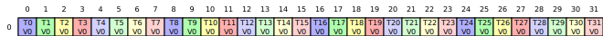
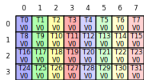
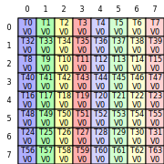

# CuTe DSL Intro

Hi! This intro assumes little to no experience programming with CuTe but it does assume experience with Cuda.
Let's dive in!

CuTe DSL is a python based higher-level abstraction built on top of Cutlass, which is itself a C++ template
library that provides optimized operations for programming GPUs.

The stated goal of Cutlass is to bridge the gap between productivity and performance for CUDA kernel development.
The goal of CuTe DSL is to enable rapid prototyping and iteration on top of Cutlass.


The goals of this blogpost are twofold.
One is to try to rapidly get _you_ sped up such that you can accomplish the stated goals of CuTe.
The second is to motivate why certain patterns exist in CuTe.


### `torch.sum` as our running example
Let's start with a simple question, how do I even run CuTe code?
A lot of this example inspiration comes from Nvidia's cutlass example [here](https://github.com/NVIDIA/cutlass/blob/main/examples/python/CuTeDSL/notebooks/elementwise_add.ipynb).


So, let's create just a simple kernel, for now only focusing on the last dimension and assume a contiguous, 2d tensor.
```python
@cute.kernel
def _reduce_sum_kernel(gA: cute.Tensor, output: cute.Tensor):
    smem_alloc = cutlass.utils.SmemAllocator()
    shmem = smem_alloc.allocate_tensor(cute.Float32, cute.make_layout((32,)))  # warp size

    tidx, _, _ = cute.arch.thread_idx()
    bidx, _, _ = cute.arch.block_idx()
    bdimx, _, _ = cute.arch.block_dim()
    lane = cute.arch.lane_idx()
    warp = cute.arch.warp_idx()

    M, N = gA.shape
    ntiles = cute.ceil_div(N, bdimx)
    acc = 0.0
    for tile_idx in range(ntiles):
        idx = tile_idx * bdimx + tidx
        if idx < N:
            acc += gA[bidx, idx]

    acc = cute.arch.warp_reduction_sum(acc)
    if lane == 0:
        shmem[warp] = acc
    cute.arch.sync_threads()

    if warp == 0:
        block_warps = bdimx // 32
        acc2 = shmem[lane] if lane < block_warps else 0.0
        acc2 = cute.arch.warp_reduction_sum(acc2)
        if lane == 0:
            output[bidx] = acc2

@cute.jit
def reduce_sum(x: cute.Tensor, output: cute.Tensor, dim=-1):
    num_warps = 4
    threads_per_block = num_warps * 32
    M, N = x.shape

    _reduce_sum_kernel(x, output).launch(
        grid=(M, 1, 1),
        block=(threads_per_block, 1, 1),
    )

def _invoke_reduce_sum(gInput, dim=-1):
    a_ = from_dlpack(gInput)

    sz = gInput.size(0) if dim == -1 else gInput.size(1)
    gOutput = torch.empty((sz,), dtype=gInput.dtype, device=gInput.device)
    b_ = from_dlpack(gOutput)

    kernel_fn = cute.compile(reduce_sum, a_, b_,)
    kernel_fn(a_, b_)
    return gOutput
```

The code here is pretty self explanatory and reads very much like regular Cuda code.
Given an MxN tensor, we will launch M blocks, where each group of threads in a block
will collectively load, reduce, then store.

Importantly, CuTe exposes several decorators, with the main ones being `@cute.jit` and `@cute.kernel`.
There are a few things we will be going over later like `from_dlpack`,
`cute.compile`, and actually launching the kernel, but for now let's take that for granted.

When you run `uv run python part1.py simple_launch`, we see `Success!`, but how fast is it? Let's compare versus torch.

Let's run `uv run python part1.py compare_torch_initial`. 
```bash
(forge-cute-py) root@33835e6c1ad1:~/forge-cute-py/docs/intro# python part1.py compare_torch_initial
  cute dsl reduce sum: 135.723 ms
  torch kernel add: 0.127 ms
```
Ok, not great! We're clearly doing something wrong.

### Motivating compilation

[Reading the docs](https://docs.nvidia.com/cutlass/latest/media/docs/pythonDSL/cute_dsl_general/dsl_jit_caching.html#custom-caching-with-cute-compile) you quickly see that `cute.compile` bypasses caching in CuTe DSL and _always_
performs compilation. There are also a [couple parameters](https://docs.nvidia.com/cutlass/latest/media/docs/pythonDSL/cute_dsl_general/dsl_introduction.html?#jit) we can control as it relates to JIT compilation.

Ok, so on the [custom caching](https://docs.nvidia.com/cutlass/latest/media/docs/pythonDSL/cute_dsl_general/dsl_jit_caching.html#custom-caching-with-cute-compile)
page in the docs, seemingly we only need a regular 
dictionary and a key that maps us back to our compiled function.

We can assume that in some future state of this function, the key for that custom cache might be some tuple of
shape, dtype, etc.

Let's try that.

```python
def _invoke_reduce_sum_with_cache(gInput, dim=-1):
    a_ = from_dlpack(gInput)

    sz = gInput.size(0) if dim == -1 else gInput.size(1)
    gOutput = torch.empty((sz,), dtype=gInput.dtype, device=gInput.device)
    b_ = from_dlpack(gOutput)

    key = f'reduce_sum_{gInput.dtype}'
    if key not in custom_cache:
        custom_cache[key] = cute.compile(reduce_sum, a_, b_)
    fn = custom_cache[key]
    fn(a_, b_)
    return gOutput
```

```bash
(forge-cute-py) root@33835e6c1ad1:~/forge-cute-py/docs/intro# python part1.py compare_torch_initial_cached
  cute dsl reduce sum: 0.115 ms
  torch kernel sum: 0.127 ms
```

Ok, caching really helped!

But what happens if we do something like this:
```python
M, N = 1024, 1024
a = torch.randn(M, N, device="cuda", dtype=torch.float32)
initial = _invoke_reduce_sum_with_cache(a, dim=-1)
assert torch.allclose(initial, a.sum(dim=-1), rtol=1e-4, atol=1e-4)

M, N = 256, 256
b = torch.randn(M, N, device="cuda", dtype=torch.float32)
after = _invoke_reduce_sum_with_cache(b, dim=-1)
assert torch.allclose(after, b.sum(dim=-1), rtol=1e-4, atol=1e-4)
```

We know that after invoking `_invoke_reduce_sum_with_cache` once, the function will jit compile, and we can run it again
without the overhead of compilation. But when you run that...

```
AcceleratorError: CUDA error: an illegal memory access was encountered
```

Hrm. Looking back up to our `_invoke_reduce_sum_with_cache` function, we see it will compile our `reduce_sum`
function with two arguments, which are both passed through a call to `from_dlpack`. Reading the docs for 
[from_dlpack](https://github.com/NVIDIA/cutlass/blob/main/python/CuTeDSL/cutlass/cute/runtime.py#L746) aren't very 
elucidating. It's purpose is to convert us "from tensor object supporting __dlpack__() to a CuTe Tensor".

Further reading, we see that using `from_dlpack` results in a CuTe tensor with a [fully static layout](https://docs.nvidia.com/cutlass/latest/media/docs/pythonDSL/cute_dsl_general/framework_integration.html#explicit-conversion-using-from-dlpack).

In speaking to [static layouts](https://docs.nvidia.com/cutlass/latest/media/docs/pythonDSL/cute_dsl_general/dsl_dynamic_layout.html#static-layout),
the docs say "if we call the compiled function with a different shape of the input torch.Tensor,
it would result in an unexpected result at runtime due to the mismatch of the type since
compiled_func expects a cute.Tensor with" a different shape.

Ok, so now this makes sense why changing the layout resulted in an access memory error.
We told the CuTe compiler that we want a single shape, then gave it something different.

So, how can we easily define static vs dynamic layouts?

Further down that page offers [advice](https://docs.nvidia.com/cutlass/latest/media/docs/pythonDSL/cute_dsl_general/dsl_dynamic_layout.html#dynamic-layout).

In order to support _any_ shapes for our kernel, we would just:
```python
@cute.jit
def reduce_sum(x: cute.Tensor, output: cute.Tensor):
    num_warps = 4
    threads_per_block = num_warps * 32
    M, N = x.shape

    _reduce_sum_kernel(x, output).launch(
        grid=(M, 1, 1),
        block=(threads_per_block, 1, 1),
    )

def _invoke_reduce_sum_with_cache(gInput, dim=-1):
    sz = gInput.size(0) if dim == -1 else gInput.size(1)
    gOutput = torch.empty((sz,), dtype=gInput.dtype, device=gInput.device)

    key = f'reduce_sum_{gInput.dtype}'
    if key not in custom_cache:
        custom_cache[key] = cute.compile(reduce_sum, gInput, gOutput)
    fn = custom_cache[key]
    fn(gInput, gOutput)
    return gOutput

> M, N = 64, 32
> b = torch.randn(M, N, device="cuda", dtype=torch.float32)
> after = _invoke_reduce_sum_with_cache(b, dim=-1)
...
DSLRuntimeError: DSLRuntimeError: expects argument #1 (x) to be <class 'cutlass.cute.typing.Tensor'>, but got <class 'torch.Tensor'>
```

Ok, it appears type hints are not _just_ hints in CuTe. But if we change the prototype of `reduce_sum` to
```python
@cute.jit
def reduce_sum(x, output):
```
And then we try:

```python
M, N = 1024, 1024
a = torch.randn(M, N, device="cuda", dtype=torch.float32)
initial = _invoke_reduce_sum_with_cache_dynamic(a, dim=-1)
assert torch.allclose(initial, a.sum(dim=-1), rtol=1e-4, atol=1e-4)

M, N = 1024, 32
b = torch.randn(M, N, device="cuda", dtype=torch.float32)
after = _invoke_reduce_sum_with_cache_dynamic(b, dim=-1)
assert torch.allclose(after, b.sum(dim=-1), rtol=1e-4, atol=1e-4)
print("Success!")
```
We see `Success!` printed. 

### Meeting in the middle

But backing up a little bit, do we really want to choose strictly between static or dynamic layouts?
When deciding how to cache compiled kernels, we’ll typically use some combination of shape, dtype, stride, and similar properties as the key.

For our reduce_sum example, the outer dimension really only affects how many blocks we launch.
Making that dimension dynamic makes a lot of sense, since it doesn’t change the structure of the generated code at all.
The inner dimension is a different story.
Changing that dimension can affect how the compiler chooses to generate code (i.e. unrolling, vectorization width, tiling strategies, etc.).
We might even want to generate different kernel variants optimized for different inner-dimension sizes,
instead of relying on one generic version that works for everything.

This is why CuTe wants you to take the [middle path](https://docs.nvidia.com/cutlass/latest/media/docs/pythonDSL/cute_dsl_general/framework_integration.html#mark-the-tensor-s-layout-as-dynamic-with-mark-layout-dynamic).
In our example, maybe we want the first dimension to be dynamic but the last dimension to be static.
So, we would want something like this:
```python
cute_dtype = cutlass.Float32
if compile_key not in compile_cache:
    m = cute.sym_int()  # dynamic!
    n = x.shape[1]  # static!
    input_cute = cute.runtime.make_fake_compact_tensor(cute_dtype, (m, n), stride_order=(1, 0))
    output_cute = cute.runtime.make_fake_compact_tensor(cute_dtype, (m,))
    fn = cute.compile(
        reduce_sum_dynamic,
        input_cute,
        output_cute,
    )
    compile_cache[compile_key] = fn
```

What this says is:
- `cute.sym_int()` says I want the first dimension to be dynamic
- `cute.runtime.make_fake_compact_tensor` says the inputs to the function will be in a certain layout
- `n = x.shape[1]` says I want one kernel variant per size of N
- `stride_order=(1, 0)` says that dimension 1 is the fastest varying / contiguous dimension

So, your compile_key might look something like `compile_key = (cute_dtype, x.shape[1], tuple(x.stride()))`

But scrolling down that `Integration with Frameworks` page in the Nvidia docs we're on, we come to a section about [TVM FFI](https://docs.nvidia.com/cutlass/latest/media/docs/pythonDSL/cute_dsl_general/framework_integration.html#leveraging-tvm-ffi-for-faster-pytorch-interop).
Ok, they have me interested with "Faster JIT function invocation", so what is TVM-FFI and how can we use it?

In the CuTe context, TVM-FFI is an optional calling interface for JIT functions that allows those functions to be called more efficiently.
If you're interested in going deeper into TVM-FFI, check [this](https://www.youtube.com/watch?v=xMzcs6AqLVo) video out.

So, basically use TVM-FFI when you care about the overhead of calling a CuTe JIT-compiled function,
or you want to call the compiled function with torch.Tensor inputs/outputs directly.
TVM-FFI will handle the interoperability.

For example, if you are benchmarking your kernels and you have an intuition that your kernel _should be_ faster but it's slower than torch's.
So, you open up nsys and see "bubbles" between your kernels,
i.e. the next kernel isn’t submitted until very noticeably after the previous one completes.
That gap is typically host-side work (Python/CuTe dispatch, conversions such as from_dlpack, etc).
TVM-FFI is used to help reduce that overhead.

So, let's use it, it couldn't be simpler and it's helpful!
```python
@cute.jit
def our_kernel(x, output, stream=None):
    ...
    _reduce_sum_kernel(...).launch(
        grid=...,
        block=...,
        stream=stream
    )

fn = cute.compile(
    our_kernel
    input_cute,
    output_cute,
    cute.runtime.make_fake_stream(use_tvm_ffi_env_stream=True),
    options="--enable-tvm-ffi",
)
```

All we need to do is add the `options="--enable-tvm-ffi"` and we can also pass the current PyTorch stream as well.

Ok, we know how to compile our code, let's actually starting writing on top of CuTe.

### Layouts

Not so fast!

Looking back at the initial kernel we wrote, it looks more like Cuda than it does like CuTe.
We haven't actually used any core abstractions that CuTe supports, namely [Layouts](https://docs.nvidia.com/cutlass/latest/media/docs/cpp/cute/01_layout.html#).
A Layout, as described in those docs, "present a common interface to multidimensional array access that abstracts away the details of how the array’s elements are organized in memory".
It's a clear statement, but the statement _itself_ feels a bit abstract.

As you can see from those docs, a [layout](https://github.com/NVIDIA/cutlass/blob/main/python/CuTeDSL/cutlass/cute/core.py#L2808)
is defined mainly by a shape and an optional stride.
Importantly, a layout is not itself data, it is the shape
and indexing rule that allows one to know where the data is stored and how to traverse it.

What is also interesting about layouts is that
they are both [hierarchical](https://docs.nvidia.com/cutlass/latest/media/docs/cpp/cute/01_layout.html#hierarchical-access-functions) and compositional, which is to say, you can define a layout of layouts.

Ok, so layouts _feel_ almost like tensor metadata.
Except, its only the view/indexing portion (i.e. the shape and stride) without dtypes, pointers, etc.

Ok, so given this, in order to layout-ify our reduce_sum kernel, we know we'd want _some_ sort of hierarchy.
If we map our current kernel to this layout frame of mind,
we know we want each thread to access a single value for each iteration in the main loop.
So, we can think of this as a layout of shape (1,). We know these N warps will be their own layout,
so we can think of them as a layout of shape (32 * N,).
Finally, we know that in a matrix of shape (M, N), we will want a layout of (M, warp_layout).

So, conceptually, something similar to:
```bash
Layout<
    (M,),
    Layout<
        (ceil_div(N, T),),
        (T,)
    >
>
```

But is this really the right way to be thinking about layouts? 

The docs are a bit heavy and too hard to follow, so let's ground ourselves and visualize!

We know that a layout is simply a mapping from thread indices to memory offsets that each thread will load/store from.
Or more generally, a mapping from logical indices to memory offsets.
But how CuTe wants us to use them seems overly confused.

I think its a great intuition pump to actually _see_ some layout visualizations.
And see how the printed layout_tv maps to the visualizations you see. Let's start with an easy one:

```python
@cute.jit
def print_layout_trash(x):
    thr_layout = cute.make_layout((32,), stride=(1,))
    val_layout = cute.make_layout((1,), stride=(1,))
    tiler_mn, layout_tv = cute.make_layout_tv(thr_layout, val_layout)
    tiler_mn = (1, tiler_mn[0])
    render_tv_layout_svg(layout_tv, tiler_mn, "tv_layout.svg")
    gX = cute.zipped_divide(x, tiler_mn)  # ((TileM, TileN), (RestM, RestN))
    print(f"gX: {gX}")


def compile_print():
    x = torch.randn(64, 32)
    gx = from_dlpack(x)
    fn = cute.compile(
        print_layout_trash,
        gx
    )
    fn(gx)
compile_print()
...
gX: tensor<ptr<f32, generic> o ((1,32),(64,1)):((0,1),(32,0))>
```


The layout visualizaton makes sense, but we need to remind ourselves what `zipped_divide` gives us.
Note that for the purpose of this post, I'm statically compiling such that it's easier to understand how things
fit together, but if/when you compile dynamically, because the compiler doesn't know the shape
of those dynamic parameters, you may see something like `(1,32),(?,?)`.

But `(1,32),(64,1)` make sense. `zipped_divide` will return a shape of (tile_size, number_of_tiles), or 
how you might usually see it defined, ((TileM, TileN), (RestM, RestN)). And this generalizes to n-dimensional
shapes as well, i.e. ((inner), (outer)), where the left hand size is fine-grained
(the position inside one tile) and the right is coarse-grained (i.e. which tile you are in).

So, with this in mind, we know we have a single tile of shape (1, 32) and 64 tiles. That's exactly our tensor!

Alright, next one. What about:

```python
> thr_layout = cute.make_layout((4, 8), stride=(8,1))
> val_layout = cute.make_layout((1,), stride=(1,))
...
gX: tensor<ptr<f32, generic> o ((4,8),(16,4)):((32,1),(128,8))>
```


Ok, so each tile is of shape (4, 8), and because our tensor is (64, 32),
we get 64 / 4 == 16 and 32 / 4 == 8. Ok, so the shapes make sense, how about the strides? 


So, again, we think inside to out. For (32, 1), in order to move 1 _row_ _within_ a tile, you will
skip 32, and to move to the next _column_ also _within_ a tile, you would skip 1. Then in terms of our grid,
it becomes intuitive, in order to skip to the next _tile row_, you would skip 4 * 32 = 128 
(i.e. one tiles worth of rows) and to move to the next _tile col_, you simply skip 8, or one tile's width.

Ok, next one:
```python
> thr_layout = cute.make_layout(((2, 4), 8), stride=((32, 8), 1))
> val_layout = cute.make_layout((1,), stride=(1,))
...
gX: tensor<ptr<f32, generic> o ((8,8),(8,4)):((32,1),(256,8))>
```



Let's work through this one. The thread layout is effectively 2d where the last dimension is 8
and the stride's last dimension is 1. So, there will be 8 columns with stride 1.
This checks out with the picture. 

Working inwards, our shape is (2, 4) and strided (32, 8). Which you can think of as 2 "row groups",
where each row group contains 4 _rows_.
Moving within a row group from one row to the next advances the thread id by 8, so each successive row starts 8 threads later.
Switching from the first to second row group advances the thread id by 32.
In the visualization, those two groups are interleaved.

### Layout recap

Ok, so layouts provide precise control over how threads are mapped to data accesses. They are clearly
highly expressive. And though they can be a bit hard to reason over, they are integral to CuTe, so it 
pays off to focus on them for a bit.

But it still doesn't feel clear how all of this fits together. We have this one world of thread-mapping views, using 
thr_layout or layout_tv, which describes how threads are organized and which element inside a tile each thread will access.
Those were our visualizations.

But we also have this other world, using functions like zipped_divide, that actually 
take some tensor and decompose it into tiles and subtiles.
Remember, we called `zipped_divide` like `gX = cute.zipped_divide(x, tiler_mn)`.

What glues these two worlds together are functions like 
`make_layout_tv`. In a function call like `tiler_mn, layout_tv = cute.make_layout_tv(thr_layout, val_layout)`
tiler_mn answers a purely data question. Namely, how big of a tile does this thread/value configuration cover?
Whereas layout_tv, as we have seen, answers the question of what element inside a tile some thread/value pair corresponds to.

Going forward we'll also see that there are a couple distinct "styles" of writing CuTe kernels. One, which we'll go over first,
which is a more manual and explicit style, and the other which presents a higher level abstraction over the first style.


### Composition based kernels

Ok, the goal of this section is the build a ReduceSum kernel that works on either dimension of a 2d tensor.
So, let's think how we'd do this.
First, we need a layout that describes which elements of a tile each thread will access.
Second, we need to decompose the input tensor into subtiles so that each thread block operates on some chunk of data.
Then, in our kernel, each block will select its corresponding tile.
Finally, each thread will load its asigned elements from that tile according the thread layout.

The following code can be found in reduce_2d.py.
Note that we're not doing bounds checking or any optimizations.
The goal here is only to illustrate the overall structure of the kernel.

```python
class ReduceSumCompositional:
    def __init__(self, shape, dtype, dim=-1):
        self.shape = shape
        self.dtype = dtype
        self.num_warps = 4
        self.warp_size = 32
        self.threads_per_block = self.num_warps * self.warp_size
        self.NEG_INF = Float32(float('-inf'))
        self.dim = dim
        self.reduce_size = self.shape[self.dim]
        self.blocks = self.shape[0] if dim != 0 else self.shape[-1]

        self.order_shape = (self.num_warps, self.warp_size) if self.dim == -1 else (self.warp_size, self.num_warps)
        self.order = (1, 0) if self.dim == -1 else (0, 1)

    @cute.jit
    def __call__(self, gInput: cute.Tensor, gOutput: cute.Tensor, stream: cuda.CUstream = None):
        val_layout = cute.make_layout((1, 1))  # each thread loads a single value
        # threads either row or column major order depending on dimension were reducing over
        thr_layout = cute.make_ordered_layout(self.order_shape, self.order)
        tiled_mn, layout_tv = cute.make_layout_tv(thr_layout, val_layout)

        # decompose our tensor into tiles defined by tiled_mn
        # gX now has the shape: ((TileM, TileN), (RestM, RestN))
        #                       ((num_warps, warp_size), (M // num_warps, N // warp_size))
        gX = cute.zipped_divide(gInput, tiled_mn)

        blocks = cute.ceil_div(self.blocks, self.num_warps)
        self.kernel(
            gX, gOutput, layout_tv
        ).launch(
            grid=(blocks, 1, 1),
            block=(self.threads_per_block, 1, 1),
            stream=stream
        )
    
    @cute.kernel
    def kernel(self, gX: cute.Tensor, gOutput: cute.Tensor, layout_tv: cute.Layout):
        tidx, _, _ = cute.arch.thread_idx()  # tidx, tidy, tidz
        bidx, _, _ = cute.arch.block_idx()
        warp_idx = tidx // self.warp_size
        lane_idx = tidx % self.warp_size

        acc = Float32(0.0)
        ntiles = cute.ceil_div(self.reduce_size, self.warp_size)
        for tile_idx in range(ntiles):
            # rows of blocks when summing across, else columns of blocks
            blk_coord = (bidx, tile_idx) if self.dim == -1 else (tile_idx, bidx)
            # gX's shape is: ((TileM, TileN), (RestM, RestN))
            # we want to load a complete subtile (i.e. all TileM x TileN values)
            # the block coordinate is a function of the dimension and if the subtiles go across or down
            subtile = gX[((None, None), blk_coord)]
            # map thread layout to data
            thr_block_frag = cute.composition(subtile, layout_tv)
            # grab this threads fragment and load
            thr_data = thr_block_frag[(tidx, None)]
            thr_data.load()
            acc += thr_data[0]

        acc = cute.arch.warp_reduction_sum(acc)
        if lane_idx == 0:
            gOutput[bidx * self.num_warps + warp_idx] = acc

```

I hope that this appears somewhat coherent now and that the comments help to elucidate.
Two functions that we haven't spoken about yet, but are very important,
that are doing a lot of heavy lifting here are
`cute.make_ordered_layout` and `cute.composition`.

`cute.make_ordered_layout` is very similar conceptually to `cute.make_layout`
but it lets us specify the traversal order of the dimensions.
This determines which dimension is contiguous (fastest varying) and which is slower.
For instance, when summing over a single row,
we want our thread block structured as [num_warps, warp_size] where each thread in a warp is adjacent 
on the same row. Whereas when summing over a column, we may want our threads adjacent along the same column.

`cute.composition` is another "glue" piece that bridges the data and thread worlds.
It specifically will compose a new view such that `R(c) = lhs(rhs(c))`.
In our case, this means that the logical (thread, value) coordinates from the layout_tv
are mapped through the subtile layout to produce actual memory addresses for each thread.

So, part of what this style gets you is an explicit, step-by-step kernel,
where it is very transparent how threads map to memory.
But for most "normal" kernels, where the thread access pattern
is regular and rectangular, it does _feel_ a little verbose.
The process of manually constructing coordinates into our tiled tensor and
loading each thread’s values seems to leave us with a lot of room to make
subtle mistakes. 

So, thankfully, there is a higher abstraction over this pattern!

### TiledCopy based kernels

Ok, so in the compositional kernel, it was really this part that we felt was too verbose
and mistake causing:
```python
blk_coord = (bidx, tile_idx) if self.dim == -1 else (tile_idx, bidx)
subtile = gX[((None, None), blk_coord)]
thr_block_frag = cute.composition(subtile, layout_tv)
thr_data = thr_block_frag[(tidx, None)]
thr_data.load()
acc += thr_data[0]
```

Thinking back to our 2d reduce sum, we know that each warp group is effectively
tiling across either all the rows or all the columns.
The only thing that changes in the for loop is the subtile index.
So we end up writing an explicit loop, manually slicing the tensor, composing layouts,
and loading one element at a time.

Ideally, there would be a simpler approach. A way to describe the entire span of data
that a warp or thread block should operate on, and then let CuTe automatically figure out
how to partition that span across our threads.

What we really want to be able to say is "here is a big chunk of memory, give each thread exactly
what it is responsible for".

And this pattern (i.e. take a tile of data, distribute it according to a thread layout, and
efficiently load it into registers) is exactly the problem that TiledCopy is meant to solve.

```python
class ReduceSumTiledCopy:
    def __init__(self, shape, dtype, dim=-1):
        self.shape = shape
        self.dtype = dtype
        self.num_warps = 4
        self.warp_size = 32
        self.threads_per_block = self.num_warps * self.warp_size
        self.NEG_INF = Float32(float('-inf'))
        self.dim = dim
        self.reduce_size = self.shape[self.dim]
        self.blocks = self.shape[0] if dim != 0 else self.shape[-1]

        self.order_shape = (self.num_warps, self.warp_size) if self.dim == -1 else (self.warp_size, self.num_warps)
        self.order = (1, 0) if self.dim == -1 else (0, 1)

    @cute.jit
    def __call__(self, gInput: cute.Tensor, gOutput: cute.Tensor, stream: cuda.CUstream = None):
        blocks_over_reduce_dim = cute.ceil_div(self.reduce_size, self.warp_size)
        
        # construct a "super tile" that spans the entire portion of the reduction
        # dimension handled by this thread block
        tiler_mn = (
            (self.num_warps, blocks_over_reduce_dim * self.warp_size)
            if self.dim == -1 else
            (blocks_over_reduce_dim * self.warp_size, self.num_warps)
        )

        # copy atom answers how should a single thread load its data
        # need to ensure our copy atom and val layout are compatible
        copy_op = cute.nvgpu.CopyUniversalOp()
        copy_atom = cute.make_copy_atom(copy_op, self.dtype, num_bits_per_copy=self.dtype.width)
        val_layout = cute.make_layout((1, 1))
        
        # define how threads are organized within a tile
        thr_layout = cute.make_ordered_layout(self.order_shape, self.order)
        tiled_copy = cute.make_tiled_copy_tv(copy_atom, thr_layout, val_layout)

        blocks = cute.ceil_div(self.blocks, self.num_warps)
        self.kernel(
            gInput, gOutput, tiler_mn, tiled_copy
        ).launch(
            grid=(blocks, 1, 1),
            block=(self.threads_per_block, 1, 1),
            stream=stream
        )
    
    @cute.kernel
    def kernel(self, gInput: cute.Tensor, gOutput: cute.Tensor, tiler_mn: cute.Shape, tiled_copy: cute.TiledCopy):
        tidx, _, _ = cute.arch.thread_idx()
        bidx, _, _ = cute.arch.block_idx()
        warp_idx = tidx // self.warp_size
        lane_idx = tidx % self.warp_size

        # gX is now a "super" tile over all subtiles that our thread group will work on
        gX = cute.local_tile(gInput, tiler_mn, (bidx, 0) if self.dim == -1 else (0, bidx))
        # where will this thread load its data from relative to our thread layout
        tidxSlice = tiled_copy.get_slice(tidx)  
        # get me all the addresses that our thread is responsible for across our "super" tile
        tidxIndices = tidxSlice.partition_S(gX)
        # create registers, load our data, reduce, and write
        tidxRegs = cute.make_rmem_tensor_like(tidxIndices)
        cute.autovec_copy(tidxIndices, tidxRegs)
        tidxValues = tidxRegs.load()
        tidLocalSum = tidxValues.reduce(cute.ReductionOp.ADD, init_val=0.0, reduction_profile=0)
        rowSum = cute.arch.warp_reduction_sum(tidLocalSum)
        if lane_idx == 0:
            gOutput[bidx * self.num_warps + warp_idx] = rowSum
```

From looking at this kernel, it does the exact same computation, but it's a lot more declarative.
There's less manual slicing and boilerplate, but it is more opaque and its computation is implicit.

At first glance, it is not clear that iteration occurs across our "super" tile.
All `tiled_copy` describes is how threads access data within a single logical tile.

The magic is in `partition_S`. This function can answer the question of "given this n-tile region,
which pieces of it belong to this thread according to our thread/value layout pattern".
It is almost doing a structured bin-packing.

In our case, `partition_S` is basically saying (in the last dimension case for example), "lay that
(num_warps, warp_size) pattern repeatedly across the full length N, and give each thread all
the indices it will wind up owning". And what's very cool is that this idea generalizes in that 
`partition_S` can work across any arbitrary n-dimensional tensor.

So, now it should be clear how these pieces fit together. `tiler_mn` will define the bounds of
some chunk of data that we want our thread group to access, `local_tile` gives us a view over
a _specific_ chunk of data, `get_slice` tells each thread which portion of a
single logical tile it is responsible for,
then `partition_S` applies this slicing across the entire data chunk.

One downside of this that I can imagine you thinking is the issue of out of bounds accesses.
It isn't obvious how, and looking through the docs we don't see,
an optional mask parameter, like we have in Triton, that we might want to give to `partition_S`.
So, if your shapes are irregular or not an exact multiple of the tile size,
you would need to add explicit "tail" logic (perhaps in the form of a compositional kernel) to handle that.

This is all great, but we've only handled the 2d case. What about N-dimensional?


### N-dimensional Reduce Sum

There are probably many ways to solve this problem, but below is my explanation on how I chose to solve it.

Any n-dimensional tensor can be viewed as 3-d tensor if you collapse some of the dimension's shapes.
This is important for us here because if we have a tensor and are reducing over dimension q of size R,
then we can view the tensor as having the shape (m, R, n), where we'd change both the before and after shapes
and strides.

Within CuTe, there exists a function `cute.make_tensor` that does just this. It creates a tensor by composing
an iterator with a layout.

So, for CuTe, we would first make our layout based on those before and after collapsed strides and shapes.
Something like:
```python
in_layout = cute.make_layout(
    (collapsed_shape_before, reduce_size, collapsed_shape_after),
    stride=(before_stride, reduce_stride, after_stride)
) 
gInputView = cute.make_tensor(gInput.iterator, in_layout)
```
and we'd apply a similar operation on the output as well.

So, once we reshape the input tensor conceptually into the 3d view (collapsed_shape_before, reduce_size, collapsed_shape_after),
the problem looks very similar to our 2d example.
The only difference is now we're tiling over the middle dimension (i.e. our reduction dimension)
instead of over rows or columns.

This means our tiler also needs to be 3d to match this view of the data.
We want the tiler to span the entire reduction dimension
while leaving the “before” and “after” dimensions untouched.
In other words, each _warp_ should operate on a region of shape `(1, reduce_size, 1)`.

By constructing a tiler of shape (1, warps_to_cover_reduce_dim * warp_size, 1),
we are telling CuTe "give me a chunk of data that covers the _full_ range we want to cover".

In the kernel itself, we isolate each warp, though we launch the kernel with multiple warps,
and so each warp will have its own, different data view,
i.e. each warp, not each thread block as before, has its own "super tile".

From there, the logic is identical to the 2d case.

Here you see just how powerful functions like `local_tile` or `partition_S` can be. Given an arbitrary
shaped and strided tensor, help to give us the exact indices that any given thread needs to work over.

```python
class ReduceSum:
    def __init__(self, shape, dtype, dim=-1):
        self.shape = shape
        self.dtype = dtype
        self.bits_read = self.dtype.width
        self.num_warps = 4
        self.warp_size = 32
        self.threads_per_block = self.num_warps * self.warp_size
        self.NEG_INF = Float32(float('-inf'))
        self.dim = dim

        rank = len(self.shape)
        strides = [1]
        mult = 1
        for d in self.shape[1:][::-1]:
            mult *= d
            strides.insert(0, mult)
        self.strides = strides

        self.reduce_size = shape[dim]

        self.before_shape = shape[:dim]
        self.after_shape = shape[dim + 1:]

        self.before_prod = math.prod(self.before_shape) if dim > 0 else 1
        self.after_prod = math.prod(self.after_shape) if dim < rank - 1 else 1

        self.before_stride = strides[dim - 1] if dim > 0 else 0
        self.after_stride = strides[-1] if dim < rank - 1 else 0
        self.reduce_stride = strides[dim]
        
        self.output_shape = (*self.before_shape, *self.after_shape)
        self.blocks = math.prod(self.output_shape)

    @cute.jit
    def __call__(self, gInput: cute.Tensor, gOutput: cute.Tensor, stream: cuda.CUstream = None):

        reduce_cover_blocks = cute.ceil_div(self.reduce_size, self.warp_size)
        copy_op = cute.nvgpu.CopyUniversalOp()
        copy_atom = cute.make_copy_atom(copy_op, self.dtype, num_bits_per_copy=self.bits_read)

        in_layout = cute.make_layout(
            (self.before_prod, self.reduce_size, self.after_prod),
            stride=(self.before_stride, self.reduce_stride, self.after_stride)
        ) 
        gInputView = cute.make_tensor(gInput.iterator, in_layout)
        out_layout = cute.make_layout(
            (self.before_prod, self.after_prod),
            stride=(self.after_prod, 1)
        )
        gOutputView = cute.make_tensor(gOutput.iterator, out_layout)

        thr_layout = cute.make_ordered_layout(
            (self.num_warps, self.warp_size),
            order=(1, 0)
        )
        val_layout = cute.make_layout((1, 1))
        tiled_copy = cute.make_tiled_copy_tv(copy_atom, thr_layout, val_layout)
        tiler_nd = (
            1,
            reduce_cover_blocks * self.warp_size,
            1
        )
        blocks = cute.ceil_div(self.blocks, self.num_warps)
        self.kernel(
            gInputView, gOutputView, tiler_nd, tiled_copy
        ).launch(
            grid=(blocks, 1, 1),
            block=(self.threads_per_block, 1, 1),
            stream=stream
        )
    
    @cute.kernel
    def kernel(self, gInput: cute.Tensor, gOutput: cute.Tensor, tiler_mn: cute.Shape, tiled_copy: cute.TiledCopy):
        tidx, _, _ = cute.arch.thread_idx()
        bidx, _, _ = cute.arch.block_idx()
        warp_idx = tidx // self.warp_size
        lane_idx = tidx % self.warp_size

        out_idx = bidx * self.num_warps + warp_idx
        before_idx = out_idx // self.after_prod
        after_idx = out_idx % self.after_prod

        gX = cute.local_tile(gInput, tiler_mn, (before_idx, None, after_idx))
        tidxSlice = tiled_copy.get_slice(tidx)  
        tidxIndices = tidxSlice.partition_S(gX)
        tidxRegs = cute.make_rmem_tensor_like(tidxIndices)
        cute.autovec_copy(tidxIndices, tidxRegs)
        tidxValues = tidxRegs.load()
        tidLocalSum = tidxValues.reduce(cute.ReductionOp.ADD, init_val=0.0, reduction_profile=0)
        rowSum = cute.arch.warp_reduction_sum(tidLocalSum)
        if lane_idx == 0:
            gOutput[before_idx, after_idx] = rowSum
```


### Final thoughts

This post is the post I wish I had when I first started using CuTe.
The main takeaway is that is that CuTe is less about writing loops than describing structure.
Once you express how threads and data relate through layouts,
the framework itself can do most of the mechanical work for you.

There's a lot more to cover, but those are topics for another day.

Thanks for reading!


Written by [Jonah](https://x.com/jonahsamost)
